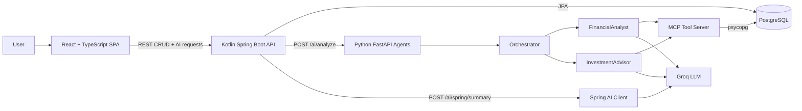
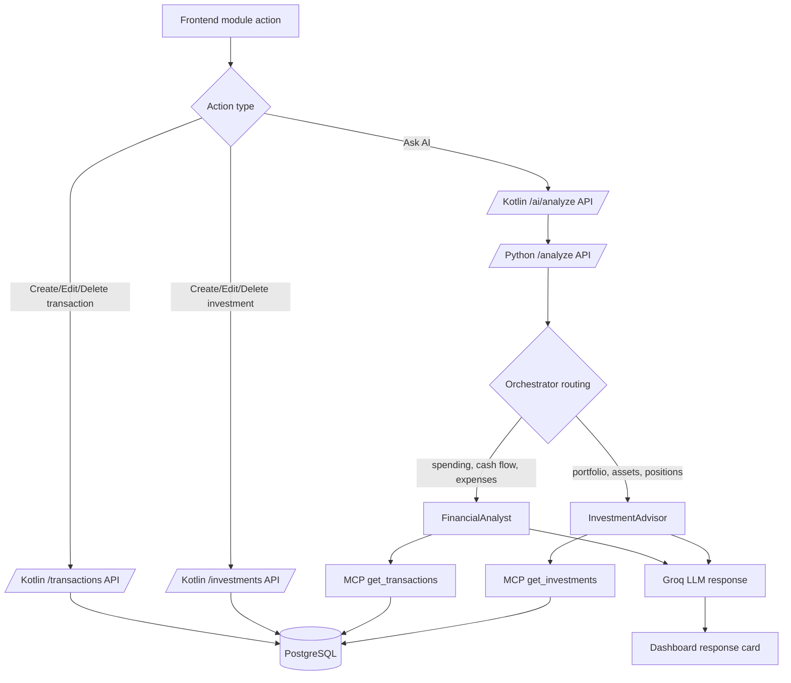
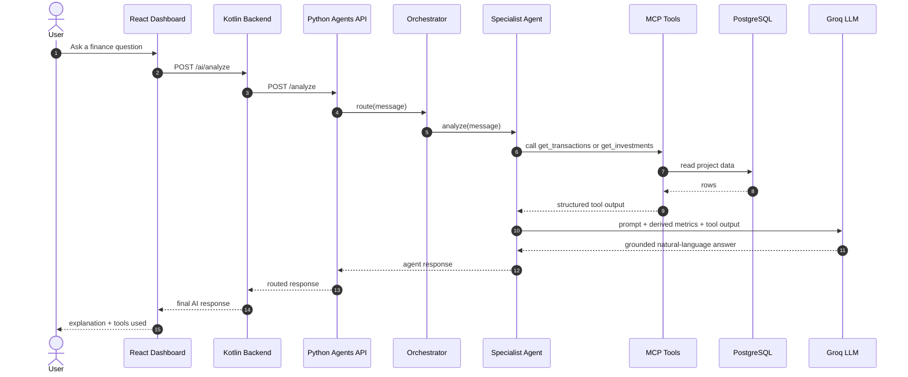
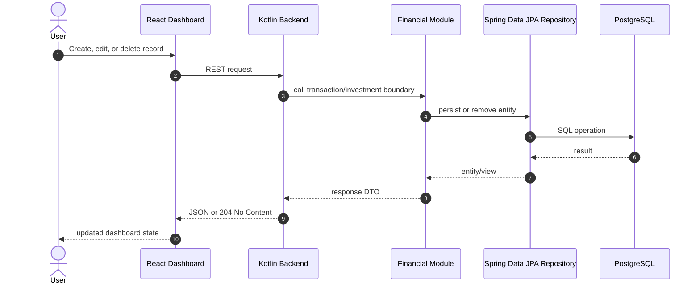
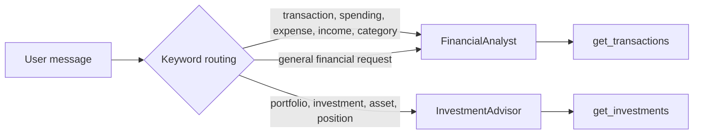
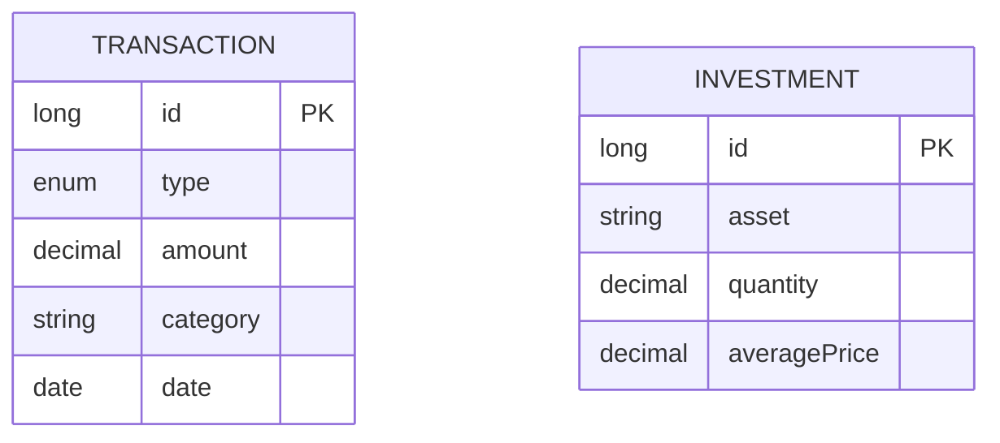

# Financial Hub

[](https://kotlinlang.org/)
[](https://spring.io/projects/spring-boot)
[](https://spring.io/projects/spring-ai)
[](https://www.python.org/)
[](https://fastapi.tiangolo.com/)
[](https://modelcontextprotocol.io/)
[](https://react.dev/)
[](https://vite.dev/)
[](https://tailwindcss.com/)
[](https://www.postgresql.org/)
[](https://docs.docker.com/compose/)

Financial Hub is a full-stack study project for modern AI-enabled financial software. It combines a modular Kotlin backend, PostgreSQL persistence, a Python multi-agent system, an MCP tool layer, Groq-backed LLM responses, Spring AI, and a polished React dashboard.

The project was built with Spec-Driven Development (SDD): each implementation step is defined in `specs.md`, validated independently, and tracked in `AGENTS.md`.

## What It Does

- Manages income and expense transactions with create, read, update, and delete flows.
- Manages investment positions with create, read, update, and delete flows.
- Displays a responsive financial dashboard with overview, transactions, investments, AI desk, and about modules.
- Routes natural-language finance questions through a Python orchestrator and specialized agents.
- Uses MCP tools as a stable boundary between agents and real PostgreSQL data.
- Provides a backend-native Spring AI endpoint using the same Groq/OpenAI-compatible strategy.
- Runs locally through one root `docker-compose.yml`.

## Architecture At A Glance



## Runtime Services

| Service | Path | Port | Purpose |
| --- | --- | ---: | --- |
| `frontend` | `frontend-react/` | `5173` | React dashboard and AI desk |
| `backend` | `backend-kotlin/` | `8080` | Kotlin REST API, JPA modules, Spring AI endpoint |
| `agents` | `agents-python/` | `8000` | Python FastAPI orchestrator and specialist agents |
| `postgres` | Docker volume under `docker/postgres-data/` | `5432` | Local PostgreSQL database |
| MCP server | `mcp-server/` | in-process | Tool layer used by Python agents |

## Main Flow



## AI Analysis Sequence



## CRUD Sequence



## Repository Structure

```text
.
|-- backend-kotlin/     # Kotlin + Spring Boot REST API and Spring AI integration
|-- agents-python/      # FastAPI multi-agent system and Groq provider integration
|-- mcp-server/         # Python MCP server and database-backed tool definitions
|-- frontend-react/     # React + TypeScript + Vite + Tailwind dashboard
|-- docker/             # Local cache/data folders used by Docker Compose
|-- docs/               # Supporting documentation area
|-- docker-compose.yml  # Root local orchestration
|-- specs.md            # Spec-Driven Development source of truth
`-- AGENTS.md           # Implementation progress tracker
```

## Technology Stack

### Backend

- Kotlin `1.9.25`
- Java `21`
- Spring Boot `3.5.7`
- Spring Web
- Spring Data JPA
- Spring Validation
- Spring AI `1.1.5`
- PostgreSQL driver
- Maven Wrapper

### AI And Agents

- Python `3.11+`
- FastAPI
- Pydantic
- MCP Python SDK
- Groq SDK
- `python-dotenv`
- Uvicorn

### MCP Server

- Installable Python `src/` layout package: `financial_hub_mcp`
- Tools:
  - `get_transactions`
  - `add_transaction`
  - `get_investments`
- Direct PostgreSQL access through `psycopg`

### Frontend

- React `19`
- TypeScript
- Vite `8`
- Tailwind CSS `4`
- Motion for React
- Handcrafted UI primitives:
  - `Button`
  - `Card`
  - `Badge`
  - `Input`
  - `Modal`
  - `Table`

## Requirements

Recommended local setup:

- Docker Desktop with Docker Compose
- Git
- A Groq API key for AI features

Optional local tooling:

- Java 21 if running the backend outside Docker
- Node.js 24 if running the frontend outside Docker
- Python 3.11 or newer if running agents/MCP outside Docker

Important note: local JDK 26 is known to be incompatible with this Kotlin/Maven setup. Prefer Docker Compose or Java 21.

## Environment Variables

Create a local ignored environment file for Groq:

```powershell
Copy-Item agents-python\.env.example agents-python\.env
```

Then edit `agents-python/.env`:

```dotenv
GROQ_API_KEY=your_groq_key_here
GROQ_MODEL=meta-llama/llama-4-scout-17b-16e-instruct
GROQ_FALLBACK_MODELS=llama-3.3-70b-versatile,llama-3.1-8b-instant
```

Security rules:

- Do not commit `agents-python/.env`.
- Keep API keys only in ignored local files or runtime environment variables.
- If your Groq key is older than 90 days, rotate it before a demo or validation run.

## Running Locally With Docker Compose

From the repository root:

```powershell
docker compose up -d
```

Open:

- Frontend: `http://localhost:5173`
- Backend health: `http://localhost:8080/health`
- Agents health: `http://localhost:8000/health`

Follow logs:

```powershell
docker compose logs -f backend
docker compose logs -f agents
docker compose logs -f frontend
```

Stop everything:

```powershell
docker compose down
```

Reset local database data:

```powershell
docker compose down
Remove-Item -Recurse -Force docker\postgres-data
docker compose up -d
```

Be careful: this deletes local PostgreSQL data.

## Running Parts Manually

Docker Compose is the recommended workflow, but the services can run manually if local runtimes are available.

### Backend

```powershell
cd backend-kotlin
.\mvnw.cmd spring-boot:run
```

Useful environment variables:

```powershell
$env:SPRING_DATASOURCE_URL="jdbc:postgresql://localhost:5432/financial_hub"
$env:SPRING_DATASOURCE_USERNAME="financial_user"
$env:SPRING_DATASOURCE_PASSWORD="financial_pass"
$env:AGENTS_BASE_URL="http://localhost:8000"
$env:GROQ_API_KEY="your_groq_key_here"
```

### Python Agents

```powershell
cd agents-python
python -m venv .venv
.\.venv\Scripts\Activate.ps1
python -m pip install -r requirements.txt
python -m financial_hub_agents.api
```

### Frontend

```powershell
cd frontend-react
npm install
npm run dev
```

## API Reference

### Backend

Base URL: `http://localhost:8080`

| Method | Endpoint | Description |
| --- | --- | --- |
| `GET` | `/health` | Database-backed health check |
| `GET` | `/transactions` | List transactions |
| `POST` | `/transactions` | Create transaction |
| `GET` | `/transactions/{id}` | Get transaction by id |
| `PUT` | `/transactions/{id}` | Update transaction |
| `DELETE` | `/transactions/{id}` | Delete transaction |
| `GET` | `/investments` | List investments |
| `POST` | `/investments` | Create investment |
| `GET` | `/investments/{id}` | Get investment by id |
| `PUT` | `/investments/{id}` | Update investment |
| `DELETE` | `/investments/{id}` | Delete investment |
| `POST` | `/ai/analyze` | Route request through Python multi-agent system |
| `POST` | `/ai/spring/summary` | Backend-native Spring AI summary |

### Python Agents

Base URL: `http://localhost:8000`

| Method | Endpoint | Description |
| --- | --- | --- |
| `GET` | `/health` | Agents API health |
| `POST` | `/analyze` | Run orchestrated AI analysis |

## API Examples

Create a transaction:

```powershell
Invoke-RestMethod `
  -Method Post `
  -Uri http://localhost:8080/transactions `
  -ContentType 'application/json' `
  -Body '{"type":"EXPENSE","amount":"39.90","category":"Cloud Subscription","date":"2026-04-30"}'
```

Create an investment:

```powershell
Invoke-RestMethod `
  -Method Post `
  -Uri http://localhost:8080/investments `
  -ContentType 'application/json' `
  -Body '{"asset":"AMZN","quantity":"4.0000","averagePrice":"186.40"}'
```

Ask the multi-agent system:

```powershell
Invoke-RestMethod `
  -Method Post `
  -Uri http://localhost:8080/ai/analyze `
  -ContentType 'application/json' `
  -Body '{"message":"How is my overall financial health right now? Please consider my cash flow, spending concentration, portfolio allocation, and where I may be able to save money."}'
```

Ask the backend-native Spring AI endpoint:

```powershell
Invoke-RestMethod `
  -Method Post `
  -Uri http://localhost:8080/ai/spring/summary `
  -ContentType 'application/json' `
  -Body '{"message":"Summarize my current financial situation using the available backend data."}'
```

## Frontend Modules

| Module | Route | Purpose |
| --- | --- | --- |
| Overview | `/#overview` | Summary cards, recent activity, portfolio pulse, AI prompt shortcuts |
| Transactions | `/#transactions` | Transaction table, filters, create/edit/delete, cash-flow insight |
| Investments | `/#investments` | Portfolio cards, create/edit/delete, persisted vibrant colors |
| Ask AI | `/#ai-desk` | Natural-language analysis through the Kotlin-to-Python agent flow |
| About | `/#about` | Discreet system-flow explanation |

Frontend UX highlights:

- Responsive layout for mobile, desktop, and ultra-wide monitors.
- Persisted light/dark theme toggle.
- Theme-aware hover and focus effects.
- Motion-powered module transitions and modal enter/exit animations.
- Icon-only CRUD action buttons with accessible labels.
- Investment colors generated and persisted in `localStorage`.

## Agent Routing



Current specialized agents:

- `Orchestrator`: chooses which specialist should answer.
- `FinancialAnalyst`: analyzes transactions, spending categories, income, expenses, and net cash flow.
- `InvestmentAdvisor`: analyzes portfolio positions, total position cost, and largest exposure.

## Data Model



## Validation Commands

Backend tests through Docker Compose:

```powershell
docker compose run --rm `
  -e SPRING_DATASOURCE_URL=jdbc:postgresql://postgres:5432/financial_hub `
  backend ./mvnw test
```

Frontend validation:

```powershell
cd frontend-react
npm run build
npm run lint
```

Python agents and MCP validation:

```powershell
cd agents-python
python tests/smoke_test.py
python tests/live_groq_smoke_test.py
python -m compileall -q src tests
python -m pip check
```

MCP server validation:

```powershell
cd mcp-server
python tests/smoke_test.py
```

## Demo Data Ideas

Use these records during a live presentation to show that the same AI question changes after new data is added.

Ask before and after:

```text
How is my overall financial health right now? Please consider my cash flow, spending concentration, portfolio allocation, and where I may be able to save money.
```

Suggested records:

| Type | Category/Asset | Amount/Quantity | Date/Average Price |
| --- | --- | ---: | ---: |
| Transaction `EXPENSE` | `Dining Out` | `184.70` | `2026-04-30` |
| Transaction `EXPENSE` | `Home Maintenance` | `680.00` | `2026-04-30` |
| Investment | `IVV` | `6.0000` | `525.40` |
| Investment | `XPML11` | `40.0000` | `112.30` |

## Development Notes

- `specs.md` is the source of truth for the incremental implementation plan.
- `AGENTS.md` records completed steps, decisions, known problems, and validation history.
- The project intentionally avoids complex authentication and production hardening because it is a study and portfolio lab.
- The backend uses `spring.jpa.hibernate.ddl-auto=update` for the current local-development stage.
- Running backend tests with schema reset settings can wipe local Compose data; reseed data afterward if needed.

## Troubleshooting

### Frontend does not reflect the latest changes

Recreate the frontend container and force-refresh the browser:

```powershell
docker compose up -d --force-recreate frontend
```

Then press `Ctrl+F5` in the browser.

### AI requests fail

Check:

- `agents-python/.env` exists.
- `GROQ_API_KEY` is set.
- The key is valid and not expired.
- `docker compose logs -f agents` has no provider errors.
- `docker compose logs -f backend` has no Spring AI or agents-client errors.

### Backend cannot connect to PostgreSQL

Check:

```powershell
docker compose ps
docker compose logs -f postgres
```

The Compose datasource should point to:

```text
jdbc:postgresql://postgres:5432/financial_hub
```

### Local Maven fails with Kotlin/JDK errors

Use Docker Compose or Java 21. Local JDK 26 is known to be incompatible with this project setup.

## License

This project includes a root `LICENSE` file.
